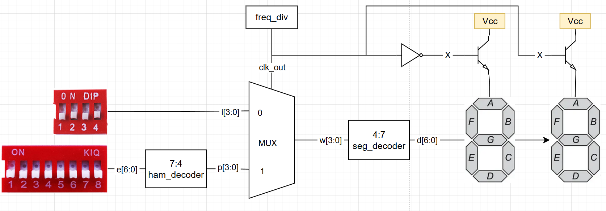
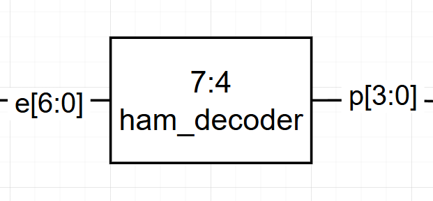
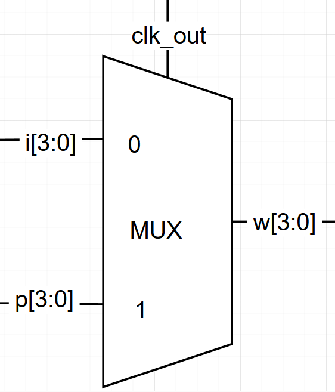
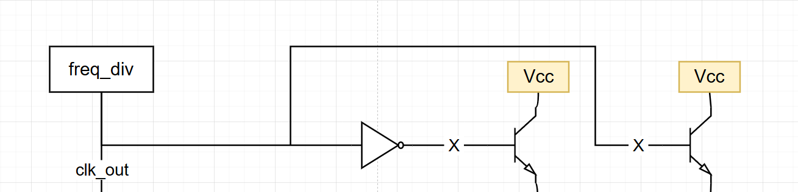

# Proyecto 1 Diseño Logico

## 1. Abreviaturas y definiciones
- **FPGA**: Field Programmable Gate Arrays

## 2. Descripción general del sistema


### **2.1 Módulo `ham_decoder`**
#### 1. Encabezado del módulo
```SystemVerilog
module ham_decoder(
    input logic [6:0] e,   // Palabra con sindrome
    output logic [3:0] p); // Sindrome
```
#### 2. Parámetros
```SystemVerilog
    assign p[3] = 1'b0;      
    assign p[2] = e[3] ^ e[6] ^ e[5] ^ e[4];
    assign p[1] = e[1] ^ e[6] ^ e[5] ^ e[2];
    assign p[0] = e[0] ^ e[6] ^ e[4] ^ e[2];
```


#### 4. Criterios de diseño



#### 5. Testbench
| Entrada  | Sindrome |
|----------|----------|
| 1110110  | 0101     |
| 1100110  | 0000     |


### **2.2 Módulo `mux`**
#### 1. Encabezado del módulo
```SystemVerilog
module mux(
    input logic clk_out,    // Señal de reloj de 1 kHz (selector)
    input logic [3:0] i,    // Palabra sin sindrome
    input logic [3:0] p,    // Sindrome
    output logic [3:0] w    // Seleccion
);

```
#### 2. Parámetros
```SystemVerilog
    always_comb begin
        w = (clk_out) ? p : i; // Si clk_1kHz = 1 -> p, sino -> i
    end
```


#### 4. Criterios de diseño



#### 5. Testbench
| Tiempo  | clk_out | i    | e    | w    |
|---------|---------|------|------|------|
| 100000  | 1       | 0001 | 1000 | 0001 |
| 200000  | 0       | 0001 | 1000 | 1000 |
| 300000  | 1       | 0001 | 1000 | 0001 |
| 400000  | 0       | 0001 | 1000 | 1000 |


### **2.3 Módulo `seg_decoder`**
#### 1. Encabezado del módulo
```SystemVerilog
module seg_decoder(
    input logic [3:0] w,   // Numero binario de 4 bits
    output logic [6:0] d); // 7 bits de control, uno por cada segmento

```
#### 2. Parámetros
```SystemVerilog
    assign d[6] =  w[1] | w[3] | (~w[2] & ~w[0]) | (w[2] & w[0]);                               // a
    assign d[5] = ~w[2] | w[1] | ~w[0];                                                         // b
    assign d[4] = ~w[1] | w[2] | w[0];                                                          // c
    assign d[3] = (~w[2] & ~w[0]) | (~w[2] & w[1]) + (w[1] & ~w[0]) | (w[2] & ~w[1] & w[0]) ;   // d
    assign d[2] = (~w[2] & ~w[0]) | (w[1] & ~w[0]);                                             // e
    assign d[1] = w[3] | (~w[1] & ~w[0]) | (w[2] & ~w[1]);                                      // f
    assign d[0] = w[3] | (~w[2] & w[1]) | (w[2] & ~w[0]) | (w[2] & ~w[1]);                      // g
```


#### 4. Criterios de diseño


#### 5. Testbench
| Decimal | Número | Segmentos |
|---------|--------|-----------|
| 0       | 0000   | 1111110   |
| 1       | 0001   | 0110000   |
| 2       | 0010   | 1101101   |
| 3       | 0011   | 1111001   |
| 4       | 0100   | 0110011   |
| 5       | 0101   | 1011011   |
| 6       | 0110   | 1111101   |
| 7       | 0111   | 1110000   |
| 8       | 1000   | 1111111   |
| 9       | 1001   | 1110011   |


### **2.4 Módulo `freq_div`**
#### 1. Encabezado del módulo
```SystemVerilog
module module_freq_div(
    input logic clk,       // Signal de reloj interno 27 MHz
    output logic clk_out,  // Signal de tasa de refresco 
    output logic x,        // Signal de control de bjt x
    output logic y);       // Signal de control de bjt y
```
#### 2. Parámetros
```SystemVerilog
    parameter frequency = 27_000_000;                   // Frecuencia de entrada (27 MHz)
    parameter freq_out = 1_000;                         // Frecuencia de salida ajustable
    parameter max_count = frequency / (2 * freq_out);   // La cuenta maxima del contador

    logic [24:0] count;  // Tamaño suficiente para almacenar max_count
```


#### 4. Criterios de diseño



#### 5. Testbench
| Time     | clk_out |
|----------|---------|
| 0        | 0       |
| 512981   | 1       |
| 1025981  | 0       |
| 1538981  | 1       |
| 2051981  | 0       |
| 2564981  | 1       |


## 4. Consumo de recursos

## 5. Problemas encontrados durante el proyecto

## Apendices:
### Apendice 1:
texto, imágen, etc

## 2. Referencias
[0] David Harris y Sarah Harris. *Digital Design and Computer Architecture. RISC-V Edition.* Morgan Kaufmann, 2022. ISBN: 978-0-12-820064-3

