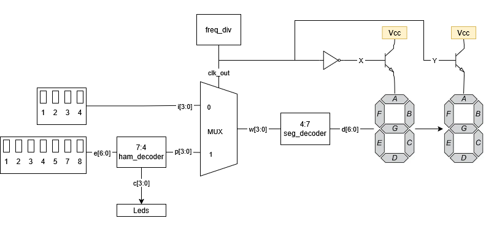
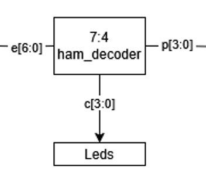
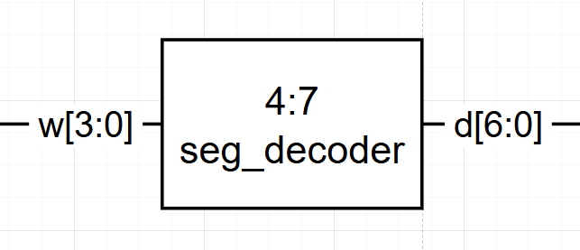

# Proyecto 1 Diseño Logico

## 1. Abreviaturas y definiciones
- **FPGA**: Field Programmable Gate Arrays
- **MUX**: Multiplexer
- **Dip Switch**: Interruptor Deslizable
- **HDL**: Hardware Development Lenguage
- **PnR**: Place and Route

## 2. Descripción general del sistema


<div style="text-align: justify"> De manera general el circuito se encarga de cambiar los números desplegados en 2 displays de 7 segmentos según los 2 inputs recibidos: Un numero en binario de 4 bits, y este mismo numero codificado por medio de un código de Hamming, que puede o no traer un error. Estas señales son enviadas a la FPGA por medio de conexiones físicas a cada uno de los pines del dispositivo, para lograr concretar tanto el numero binario como el mensaje codificado se utilizan Dip Switches para lograr cambiar la señal recibida a muchos 1 y 0, básicamente, reduciendo de una vez el mensaje a bits. Luego, dentro del código, se utiliza un decodificador para lograr tanto leer el mensaje, decodificarlo y lograr obtener donde se encuentra el error presente en el mensaje, además de lograr desplegar este número a las leds integradas en la FPGA. Una vez se tiene el numero original y la posición donde se encuentra el error, esto se envía directamente a un MUX, el cual, mandara estos datos a un decodificador encargado de representar los números a los display de 7 segmentos.  Para lograr esto, se tiene un módulo el cual actúa como un clock, o una señal oscilante, la cual es enviada tanto al MUX, como a 2 transistores presentes en la protoboard física. El clock permite 2 cosas dependiendo de cual sistema este recibiendo su señal: Si son los transistores, estos básicamente se encargan tanto de apagar como prender cada uno de los displays, por lo que uno de ellos posee una inversión de la señal recibida, esto para alternarlos. Cuando uno recibe un 1 y enciende el display correspondiente, el otro recibe 0 y no permite la activación. Relacionado a esto, el clock recibe la señal del clock el cual indica si tiene que dejar pasar la señal de la palabra, o del mensaje codificado. Por lo que un display prende y muestra el numero original, y después el otro prende y muestra donde se encuentra el error en el mensaje codificado. </div>
 

### **2.1 Módulo `ham_decoder`**
#### 1. Funcionamiento
<div style="text-align: justify"> El codificador de Hamming se encarga de recibir el mensaje codificado enviado desde los Dip Switches y lograr realizar una decodificación de Hamming al obtener los síndromes necesarios para lograr posicionar el error presente en este. Para esto se realiza la decodificación con los bits de paridad y se asignan a p[2:0] dejando el cuarto bit siempre en 0. Por último, este mismo modulo se encarga de lanzar los valores del número correcto hacia las leds de la FPGA, permitiendo desplegar el numero correcto ahi. </div>

#### 2. Encabezado del módulo
```SystemVerilog
module ham_decoder(
    input logic [6:0] e,   // Palabra con sindrome
    output logic [3:0] p); // Sindrome
```
#### 3. Parámetros
```SystemVerilog
    assign p[3] = 1'b0;      
    assign p[2] = e[3] ^ e[6] ^ e[5] ^ e[4];
    assign p[1] = e[1] ^ e[6] ^ e[5] ^ e[2];
    assign p[0] = e[0] ^ e[6] ^ e[4] ^ e[2];
```


#### 4. Criterios de diseño



#### 5. Testbench
| Entrada  | Sindrome |
|----------|----------|
| 1110110  | 0101     |
| 1100110  | 0000     |


### **2.2 Módulo `mux`**
#### 1. Funcionamiento
<div style="text-align: justify"> El módulo MUX se encarga de decidir cuál de los 2 valores que recibe dejara pasar a ser desplegados en los 7SD. Para esto, y como todo modulo MUX, utiliza una tercera señal, siendo el clock la cual es la encargada de ir oscilando cuál de los 2 valores va a dejar entrar. De esta manera, no se representan ambos numeros al mismo tiempo. </div>

#### 2. Encabezado del módulo
```SystemVerilog
module mux(
    input logic clk_out,    // Señal de reloj de 1 kHz (selector)
    input logic [3:0] i,    // Palabra sin sindrome
    input logic [3:0] p,    // Sindrome
    output logic [3:0] w    // Seleccion
);

```
#### 3. Parámetros
```SystemVerilog
    always_comb begin
        w = (clk_out) ? p : i; // Si clk_1kHz = 1 -> p, sino -> i
    end
```


#### 4. Criterios de diseño


#### 5. Testbench
| Tiempo  | clk_out | i    | e    | w    |
|---------|---------|------|------|------|
| 100000  | 1       | 0001 | 1000 | 0001 |
| 200000  | 0       | 0001 | 1000 | 1000 |
| 300000  | 1       | 0001 | 1000 | 0001 |
| 400000  | 0       | 0001 | 1000 | 1000 |


### **2.3 Módulo `seg_decoder`**
#### 1. Funcionamiento
<div style="text-align: justify"> Este módulo es el encargado de, al recibir cualquiera de las 2 señales provenientes del MUX (síndrome o número) puedan ser desplegadas en el display de siete segmentos, esto por medio de asignar a cada una de las entradas del display un valor de acuerdo a la ecuación asignada en el módulo. De esta manera, la palabra recibida de cuatro bits se transforma en 7 bits que se envían a los display y encienden cada segmento respectivamente.</div>

#### 2. Encabezado del módulo
```SystemVerilog
module seg_decoder(
    input logic [3:0] w,   // Numero binario de 4 bits
    output logic [6:0] d); // 7 bits de control, uno por cada segmento

```
#### 3. Parámetros
```SystemVerilog
    assign d[6] =  w[1] | w[3] | (~w[2] & ~w[0]) | (w[2] & w[0]);                               // a
    assign d[5] = ~w[2] | w[1] | ~w[0];                                                         // b
    assign d[4] = ~w[1] | w[2] | w[0];                                                          // c
    assign d[3] = (~w[2] & ~w[0]) | (~w[2] & w[1]) + (w[1] & ~w[0]) | (w[2] & ~w[1] & w[0]) ;   // d
    assign d[2] = (~w[2] & ~w[0]) | (w[1] & ~w[0]);                                             // e
    assign d[1] = w[3] | (~w[1] & ~w[0]) | (w[2] & ~w[1]);                                      // f
    assign d[0] = w[3] | (~w[2] & w[1]) | (w[2] & ~w[0]) | (w[2] & ~w[1]);                      // g
```


#### 4. Criterios de diseño



#### 5. Testbench
| Decimal | Número | Segmentos |
|---------|--------|-----------|
| 0       | 0000   | 1111110   |
| 1       | 0001   | 0110000   |
| 2       | 0010   | 1101101   |
| 3       | 0011   | 1111001   |
| 4       | 0100   | 0110011   |
| 5       | 0101   | 1011011   |
| 6       | 0110   | 1111101   |
| 7       | 0111   | 1110000   |
| 8       | 1000   | 1111111   |
| 9       | 1001   | 1110011   |


### **2.4 Módulo `freq_div`**
#### 1. Funcionamiento
<div style="text-align: justify"> El divisor de frecuencia actua como un estilo de reloj logico, periodicamente entregando un valor de 0 o 1, esto para lograr alternar ciertas partes del circuito que no pueden funcionar simultaneamente, como por ejemplo el decodificador para los 7 segmentos, o para el transistor que enciende cada uno de los segementos </div>


#### 2. Encabezado del módulo
```SystemVerilog
module module_freq_div(
    input logic clk,       // Signal de reloj interno 27 MHz
    output logic clk_out,  // Signal de tasa de refresco 
    output logic x,        // Signal de control de bjt x
    output logic y);       // Signal de control de bjt y
```
#### 3. Parámetros
```SystemVerilog
    parameter frequency = 27_000_000;                   // Frecuencia de entrada (27 MHz)
    parameter freq_out = 1_000;                         // Frecuencia de salida ajustable
    parameter max_count = frequency / (2 * freq_out);   // La cuenta maxima del contador

    logic [24:0] count;  // Tamaño suficiente para almacenar max_count
```


#### 4. Criterios de diseño


#### 5. Testbench
| Time     | clk_out |
|----------|---------|
| 0        | 0       |
| 512981   | 1       |
| 1025981  | 0       |
| 1538981  | 1       |
| 2051981  | 0       |
| 2564981  | 1       |


## 4. Consumo de recursos

Usando solamente los bancos de 3.3V, y asumiendo que la corriente es de 100mA, podemos estimar que el consumo de potencia sin uso del LCD se encuentra aproximadamente en los 0.33WH

## 5. Problemas encontrados durante el proyecto
Durante la realización del proyecto se encontraron varios problemas:
1.  Poca familiaridad con el lenguaje de Verilog y su sintaxis
- R/ Uso de recursos en línea como videos tutoriales, paginas web, datasheets y manuales de la FPGA. 

2. Falta de disponibilidad de ambos estudiantes para lograr reunirse
- R/ Mas coordinación y comunicación además de lograr subir el nivel de prioridad del proyecto. 

3.  Poca familiaridad con el dispositivo Tang Nano 9k
- R/ Uso de tanto manuales como tutoriales para lograr entender su funcionamiento adecuado. 

4.  Incapacidad de las instrucciones del proyecto para presentar ciertas ideas o direcciones
- R/ Aclaración de estas dudas tanto con el profesor como el asistente del curso para lograr implementar todas las ideas. 

5.  Fallos desconocidos tanto en la parte física como en la implementación del código.
- R/ Realizar troubleshooting en la parte de programación por medio de los test benchs como en la parte física por medio de herramientas de laboratorio. 

## Apendices:
## 1. Referencias
[0] David Harris y Sarah Harris. *Digital Design and Computer Architecture. RISC-V Edition.* Morgan Kaufmann, 2022. ISBN: 978-0-12-820064-3

[1] Sipeed. 2024. Tang Nano 9K. Sipeed Wiki. Available at: https://wiki-sipeed-com.translate.goog/hardware/en/tang/Tang-Nano-9K/Nano-9K.html?_x_tr_sl=en&_x_tr_tl=es&_x_tr_hl=es&_x_tr_pto=tc. Accessed: Feb 31, 2025.

[2] Lushay Labs. 2024. Getting Setup with the Tang Nano 9K. Lushay Labs Learning. Available at: https://learn.lushaylabs.com/getting-setup-with-the-tang-nano-9k/. Accessed: Apr. 2, 2025.

[3] O. A. Martínez Rodríguez, "Divisor de frecuencia en Verilog," YouTube, 2016. https://www.youtube.com/watch?v=sLz8vAvoils. Accedido: 5-abr-2025.